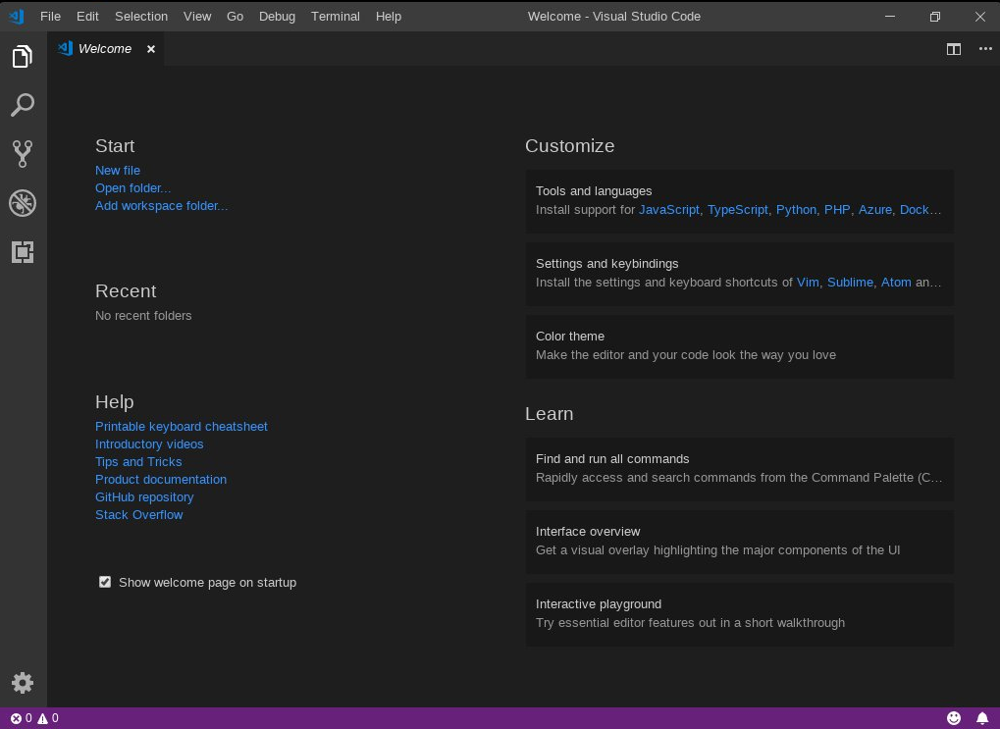
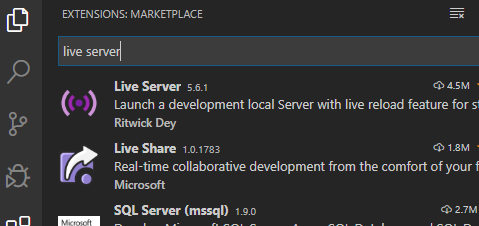

# Set-Up
We need to set your enviorment up so you can start coding

# Basic Setup
For lessons 1-3
We need to do 2 things
  - Get an a text editor/IDE (Integrated Development Environment)
    - so you can start coding
    - we will be using [VS Code]
  - Download an extension to run your code
    - so you can see your code in a browser such as chrome
    - we will be using "live server"

Step 1- Download VS Code
- go here https://code.visualstudio.com/download and download your IDE
    - you can click through the default settings on your computer
    

Step 2- Download Live Server
- open up vs code, click the extensions icon in the side bar
    - in the extensions search bar search for 'live server' and install it
    

# Additional Setup
For lessons 3-6

- Get CSS formatter, JS Formatter

- Install [Git]

- Set up a [Github] account
 
For lessons 6-9
- Install [Node]

   [VS Code]: <https://code.visualstudio.com/download>
   [Git]: <https://git-scm.com/downloads>
   [GitHub]: <https://github.com/>
   [Node]: <https://nodejs.org/en/download/>
   <!-- [vsCodeImg]: <./pics/vs-code.PNG> -->
   <!-- [liveServerImg]: <./pics/live-server.PNG> -->